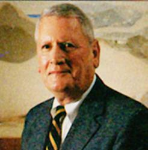

:title: Level 5 Leadership
:data-transition-duration: 1500
:css: hovercraft.css

This is a demo for Hovercraft! You can view it as a finished presentation
at http://regebro.github.com/hovercraft/

It's also useful as an example, in which case it's supposed to be read as
`source code <../_sources/examples/hovercraft.txt>`_.

You can render this presentation to HTML with the command::

    hovercraft hovercraft.rst outdir

And then view the outdir/index.html file to see how it turned out.

If you are seeing this text, and not reading this as source code, you are
doing it wrong! It's going to be confusing and not very useful.

Use The Source, Luke! But first you probably want to read through the
official documentation at https://hovercraft.readthedocs.io/

----

Question:
============

Do You Know *Level 5 Leaders?*

----

.. image:: images/DarwinESmith.jpg
    :height: 250px
    :width: 200px

----

Good To Great!
=====================

.. image:: images/difference between good and great at value.png
    :height: 440px
    :width: 690px

----

Methodology!
========================

 **1435 Companies  (1965-1995)**

 **11 Found**

 **6.9 Times More Return**

:data-y: r1000

----

now
=========

**Cracking The Code!**

----

:data-rotate: 90

FlyWheel
============

.. image:: images/gtgfw.jpg
    :height: 440px
    :width: 570px

----

:data-x: r0
:data-y: r500
:data-scale: 0.1

Level 5
============

**Humility + Will**

----

:data-x: r-800
:data-scale: 1

Leadership Hierarchy
======================

**Level 5**

**Effective Leader**

**Competent Manager**

**Contributing Team Member**

**be-Highly Capable Individual-wide:D**

----

Basic Qualities 
======================

1. They Set up Successors for Success.

2. They are Compellingly Modest.

3. They Have Unwavering Resolve.

----

:id: ThreeD
:data-y: r1200
:data-rotate-x: 180

And...
======

4. The Window and the Mirror

----

**Born or Bred?**
===========================

----

:data-x: r800

**Yin and Yang of Level 5**
============================

Personal Humility

Professional Will

----

:id: thequestion
:data-x: r0
:data-y: r-1200

*Not by Level 5 Alone*
=======================

----

:data-rotate-y: 180
:data-scale: 3
:data-x: r-2500
:data-y: r0

Do Not Forget **FlyWheel!**
===========================

.. image:: images/gtgfw.jpg
    :height: 440px
    :width: 570px

----

:data-x: r-3000
:data-scale: 1

First Who ... Then What
------------------------
Get The Right People!

----

:data-y: r-1200

Brutal Facts!
===============

Confront Them!

----

The Hedgehog Concept
=====================

.. image:: images/thdgc.png
    :height: 620px
    :width: 1100px

----

A Culture of Discipline
=========================

Self-Disciplined People

----

Technology
===========

is just a Tool!

------

**Again FlyWheel!**
====================

.. image:: images/gtgfw.jpg
    :height: 440px
    :width: 570px

----

:data-x: 0
:data-y: 2500
:data-z: 4000
:data-rotate-x: 90

**Level 5 Leadership!**
========================

On :

amirseyvani.github.io

